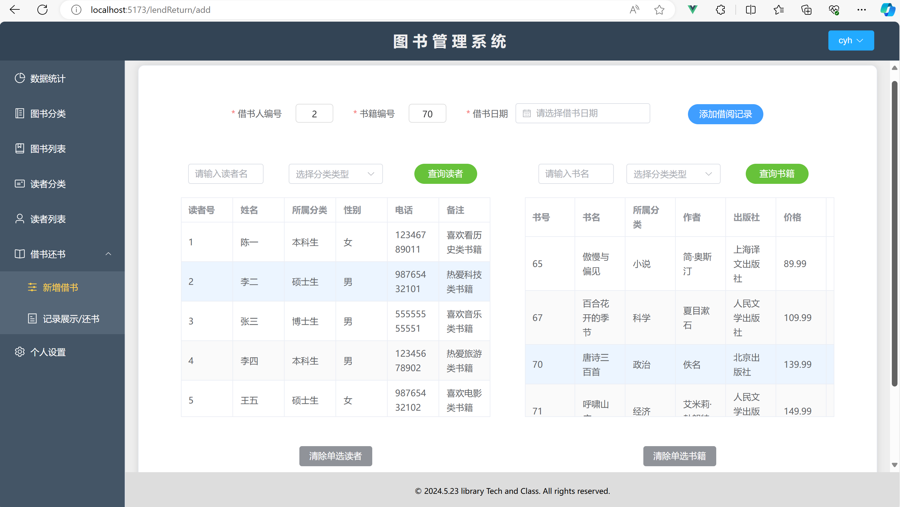

# 图书管理系统（数据库课设）


## 一、系统目标

图书管理信息系统实现的总目标，是使图书馆的信息管理工作系统化、规范化、自动化，

从而达到提高企业人事管理效率的目的。要求实现如下目标：

### 1、数据输入部分 

包括图书基本信息的录入、借阅人基本信息的录入、用户基本信息的录入。

### 2、数据输出部分 

主要是各种统计查询，如：根据图书信息（如书名、作者、出版社等）查阅图书及其借阅信息、统计输出图书类型比例等。

### 3、数据处理部分 

主要包括借阅和归还的处理，如一本书借出后，必须在数据库中将该书标记为已借出，以防出现数据库中有书但图书馆无书的情况。一本书归还后，同样必须在数据库中将其标记为已经归还，以便再次借出。


## 二、功能要求

根据以上实现目标，图书管理系统的主要功能包括：

1、读者种类的定义、更新、查询 主要实现读者种类标准的制定，如：种类编号、种类名称、借书数量、借书期限、有效期限、备注等。

2、读者基本信息的输入、查询、更新 包括读者编号、读者姓名、读者种类、读者性别、工作单位、家庭住址、电话号码、电子邮件地址、登记日期、备注等。

3、书籍类别的定义、更新、查询 主要实现书籍类别标准的制定，如：类别编号、类别名称、关键词、备注信息等。

4、书籍信息的输入、查询、更新 包括书籍编号、书籍名称、书籍类别、作者姓名、出版社名称、出版日期、价格、书籍页码、关键词、登记日期、是否被借出、备注信息等。

5、旧书销毁 对于淘汰、损坏、丢失的书目可及时对数据库进行修改。

6、借还书信息的输入、查询、更新 包括借阅编号、读者编号、书籍编号、出借日期、还书日期、备注信息等。

7、方便、灵活的查询 如：以书名、作者、出版社、出版时间（确定的时间或时间段、某一时间之前、某一时间之后）等信息进行图书检索，并能反映出图书的借阅情况，以借阅人编号对借阅人信息进行检索，以出版社名称查询出版社联系方式信息等。

8、统计分析功能 可以展现出图书类型比例、库存与借出比例等统计信息。


## 三、数据库设计

### 1、E-R图

根据上述要求，设计了 E-R 图来表示系统中的实体及实体与实体之间的联系情况，从而直观地看出整个系统的情况。

E-R 图如下图所示：


（手绘E-R图）


（IDEA生成的数据库表关系图）

### 2、关系模型

我们根据绘制的 E-R 图，转换成关系模型，从而更好地看出表结构以及表设计的内容。 

关系模型如下所示：

```
读者种类表r_category
（id，名称，可借数量，借书期限，有效期，备注）

读者表reader
（id，姓名，种类id*，性别，工作地址，家庭地址，电话，邮箱，创建时间，备注）

书籍种类表b_category
（id，名称，关键词，备注）

书籍表book
（id，名称，种类id*，作者，出版社，出版日期，价格，页数，关键词，创建时间，状态，备注）

借书还书表lend_return
（id，读者id*，书籍id*，借书日期，还书日期，状态，备注）

管理员表 manager
（id，账号，密码）

注：下划线 表示该表的主键， *表示有外键约束
```

其中，每个表的id都作为主键，读者和图书的分类id都需要添加外键约束，分别关联读者分类表、图书分类表的主键id，才能保证数据的关联性和完整性。同时，借还书记录表为一个多对多的关系表，一个读者可以借阅多本书，一本书在不同时间内也可以被多个读者所借阅，因此每条借书记录需要有借书人的id和图书的id信息来标识这条记录，同时借书人的id、图书id也都有外键约束，分别关联着读者表的主键id和图书表的主键id，以保证数据的关联性和完整性。

### 3、创新点

在根据要求设计数据库的各个表时，我们发现借书还书表只有借书还书时间的属性还不够，由于需要考虑是否还书成功来更新图书状态（是否归还到图书馆中，如果已归还便可以被其他人所借阅），因此还需要设计一个还书状态的属性，根据这个属性来判断书籍是否成功归还。在这个属性中有几个还书状态：出借中、正常归还、逾期归还、丢失无法归还、损坏归还、其他（请备注说明）。若正常归还、损坏归还则说明还书成功，其他情况都视为还书不成功，若其他原因时，在修改信息时需要在备注属性里输入对应值，才能够更新这条借还书记录。


## 四、开发过程

### 1、技术选型

使用前后端分离技术进行web网页端开发。

前端：html、less、typescript、vue3、ElementPlus、Echarts、Pinia。

后端：java语言，利用springboot框架进行开发，使用mybatis来连接mysql数据库，并进行相关sql语句的编写。

### 2、前端数据展示

#### （1）统计报表模块

采用ECharts可视化库，来进行各种数据图表的绘制，包括图书读者分类数量，借书还书统计以及人气书籍Top排行榜等，具体展示图如下：


#### （2）图书模块

包括图书分类和图书列表，均实现了对应的增删改查功能，管理员点击相关按钮即可操作。


（添加分类示意图）


（图书列表分页展示图）

#### （3）读者模块

与图书模块功能类似，读者分类和读者列表均有对应的增删改查功能。


（读者分类分页查询）


（读者信息修改）

#### （4）借书还书模块

进入借书页面，页面下方会分页展示读者列表和图书列表，其中图书都是当前处于图书馆中未被出借的书。管理员可以单选其中一个读者和一本书籍，表示借书，对应的上方表单会回显对应的读者和图书的id，再选择借书日期后便可进行借书记录的新增操作。



（新增借书页面）

进入记录展示页面，会分页显示所有借还书记录，同时状态栏还会以不同颜色标准不同的还书状态。


（记录展示）

进行还书时，需要选择还书日期（在借书日期之后且不能晚于当前日期），填写完相关信息后即可还书，本页面下面还有借书人和对应书籍的详细信息展示。


（还书页面）

#### （5）管理员模块

在个人设置页面中，管理员可以修改个人信息，修改完密码会跳转到登录页进行重新登录操作，也可以新注册一个管理员账号进行登录，登录模块用到了jwt校验，token生成等知识。


（个人信息页）


（登录页）

### 3、后端与数据库关联

后端使用java语言编写，利用mybatis来连接mysql数据库，在后端项目的服务层server模块中，分了controller，service，以及mapper三层架构。

（1）controller负责处理前端发过来的请求接口，并调用service进行处理，最后返回对应数据给前端。

（2）service负责逻辑处理，比如借书时不仅需要新增借还书记录，还需要设置书籍状态为出借中，这两个处理需要分别调用mapper层的相关sql语句操作。

（3）mapper层负责sql语句编写，在连接完mysql后，mapper层中的方法一但被service层调用，对应的sql语句便会执行，从而进行数据库的增删改查操作。

mapper中相关的sql命令如下图：


（mapper接口中写简单的sql）


（mapper.xml文件中写较为复杂的sql）

（4）本项目还有另外common和pojo两个模块，分别存放着一些工具类（常量类、异常类、前后端数据传输格式类等）和项目所需的对象实体类（如图书类、读者类等），通过模块化处理能使项目开发得更规范，开发效率也得到提升。

### 4、功能测试

本图书管理系统开发过程中进行了许多次调试，并发现了一些bug。如：一个读者借书时，要考虑当前读者已借阅书籍的总数量，若达到总数量则无法进行借书操作，但是前端操作时还是能借书成功；又如：读者借书后，需要将书籍标记为已借出，并不允许别人借书，但是在别人借书的操作页面上，其书籍列表仍然展示着该本被借出的书籍。

代码调试后发现：主要是在后端service服务层没处理好，有些变量大小写没注意，或者调用错了sql语句，导致sql没有正常执行，数据库中的信息没有正常更新，因此需要不断进行修改，去除bug。

此外，为了防止前端进行某些非法操作，在前端传给后端数据后，后端需要对这些数据进行一系列校验处理，并自定义异常类，将捕获到的这些不合理数据封装起来，响应给前端，前端拿到数据后利用 `ElementPlus` 组件库的消息弹窗组件，将这些信息提示给用户，从而保证前后端数据交互符合逻辑，以及保证数据库相关增删改查的合法性和完整性，不易造成数据丢失，数据不一致等情况。


## 五、结果分析

1、表结构设计较好，在满足实验要求的同时，根据需求进行相应的改进创新，同时利用外键约束将不同表之间联系起来，也保证了数据的完整性约束。此外，表中的字段和前后端的数据格式对应起来，在设计完善好数据库之后再进行开发会较为顺利，提高开发效率。

2、前后端交互顺利，对于前端管理员发起的增删改查等操作，后端对应的接口都能识别到，进行相应逻辑处理并执行sql语句，更改数据库中的数据信息，同时相应给前端所需要的格式化数据。使得前端页面操作顺利，交互合理。

最后，如果觉得本项目对你有帮助的话，求求点个star🤩吧，谢谢了~